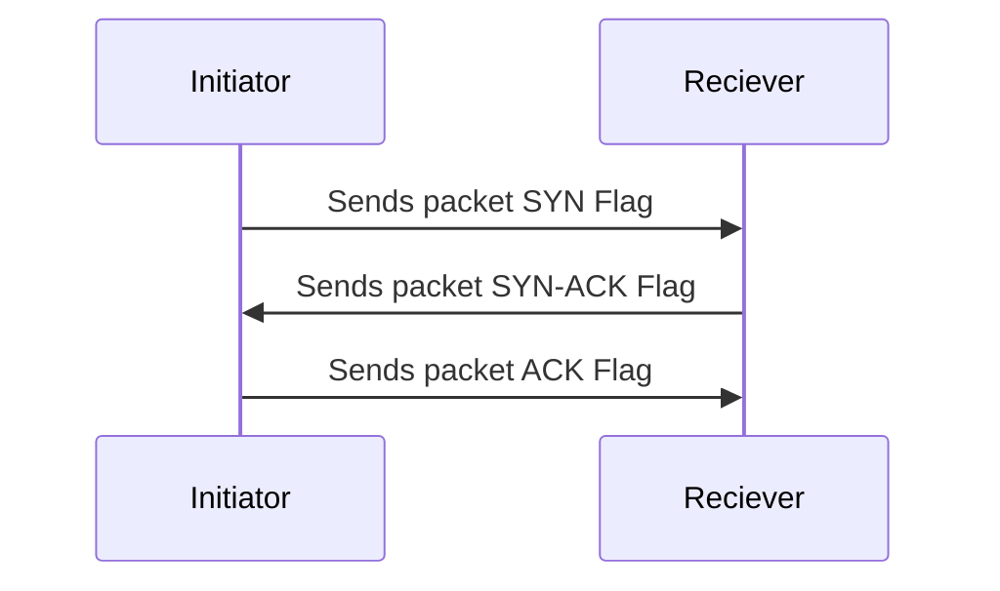

# TCP UDP
## OSI Model
Details of OSI Model are here [[OSI Layers]]

MEMO: **P**lease **D**o **N**ot **T**hrow **S**ausage **P**izza **A**way.

| OSI Model    |               |
| ------------ | ------------- |
| Application  |               |
| Presentation |               |
| Session      |               |
| Transport    | TCP/UDP       |
| Network      | IP address    |
| Data Link    | MAC address   |
| Physical     | Ethernet/RJ45 |
- Session Multiplexing
- Segmentation: MT U depends on physical medium
	- MTU of Fast Ethernet is **1500** bytes
	- TCP support **65495** bytes
	- TCP supports MSS and Path MTU discovery
	- MSS **Maximum Segment Size** in Bytes
		- sender and reciver can automatically determine max transmission
- Flow Control 
	- To avoid sending data too quickly
	- if sender sends data faster than receiver can handle, receiver drop data and require retransmission
- TCP - Connection oriented
- TCP - Once transmission is complete the session is terminated
- UDP - Connectionless
- UDM - there are no session
- Reliability:
	- every segment transmitted is acknowledge
	- UDP does not implement reliability
## Ethernet Frame
In [[Cabling and packet flows]] there is information about MAC Address.

**Ethernet II framing** (also known as **DIX Ethernet**, named after [DEC](https://en.wikipedia.org/wiki/Digital_Equipment_Corporation "Digital Equipment Corporation"), [Intel](https://en.wikipedia.org/wiki/Intel "Intel") and [Xerox](https://en.wikipedia.org/wiki/Xerox "Xerox"), the major participants in its design, defines the two-octet [EtherType](https://en.wikipedia.org/wiki/EtherType "EtherType") field in an Ethernet [frame](https://en.wikipedia.org/wiki/Frame_(telecommunications) "Frame (telecommunications)"), preceded by destination and source MAC addresses, that identifies an [upper layer protocol](https://en.wikipedia.org/wiki/Upper_layer_protocol "Upper layer protocol") [encapsulated](https://en.wikipedia.org/wiki/Encapsulation_(networking) "Encapsulation (networking)") by the frame data. Most notably, an EtherType value of **0x0800** indicates that the frame contains an [IPv4](https://en.wikipedia.org/wiki/IPv4 "IPv4") datagram, **0x0806** indicates an [ARP](https://en.wikipedia.org/wiki/Address_Resolution_Protocol "Address Resolution Protocol") datagram, and **0x86DD** indicates an [IPv6](https://en.wikipedia.org/wiki/IPv6 "IPv6") datagram. See [EtherType § Values](https://en.wikipedia.org/wiki/EtherType#Values "EtherType") for more.

![[Ethernet_Type_II_Frame_format.png]]
## TCP UDP Comparison

| feat            | reliable            | best effort/unreliable |
| --------------- | ------------------- | ---------------------- |
| Connection type | Connection oriented | Connectionless         |
| Protocol        | TCP                 | UDP                    |
| Sequencing      | Yes                 | No                     |
| Application     | HTTP                | Voice Streaming        |
|                 | E-mail              | Video Streaming        |
|                 | FTP                 |                        |

### UDP 
- Transport Layer Protocol: [[OSI Layers]]
- Access to Layer 3 without the overhead of reliability mechanisms
- Connectionless protocol (no handshakes, just data arrives from source )
- Provides limited error delivery, there is a port number on receiver site
- Provided best effort delivery
#### UDP Header
Details are [here](https://en.wikipedia.org/wiki/User_Datagram_Protocol): 
A UDP datagram consists of a datagram _header_ followed by a _data_ section (the payload data for the application). The UDP datagram header consists of 4 fields, each of which is 2 bytes (16 bits):

![[UDP_header.png]]

##### Source port number
This field identifies the sender's port, when used, and should be assumed to be the port to reply to if needed. If not used, it should be zero. If the source host is the client, the port number is likely to be an ephemeral port. If the source host is the server, the port number is likely to be a [well-known port](https://en.wikipedia.org/wiki/Well-known_port "Well-known port") number from 0 to 1023.

##### Destination port number
This field identifies the receiver's port and is required. Similar to source port number, if the client is the destination host then the port number will likely be an ephemeral port number and if the destination host is the server then the port number will likely be a well-known port number.
##### Length
This field specifies the length in bytes of the UDP header and UDP data. The minimum length is 8 bytes, the length of the header. The field size sets a theoretical limit of 65,535 bytes (8-byte header + **65,527** bytes of data) for a UDP datagram.
Using IPv6 [jumbograms](https://en.wikipedia.org/wiki/Jumbogram "Jumbogram") it is possible to have UDP datagrams of size greater than 65,535 bytes. The length field is set to zero if the length of the UDP header plus UDP data is greater than 65,535.

The [checksum](https://en.wikipedia.org/wiki/Internet_checksum "Internet checksum") field may be used for error-checking of the header and data. This field is optional in IPv4, and mandatory in most cases in IPv6.[[7]](https://en.wikipedia.org/wiki/User_Datagram_Protocol#cite_note-rfc8200-7) The field carries all-zeros if unused.

### TCP
- Transport Layer Protocol: [[OSI Layers]]
- Access to the network layer for Applications
- Connection oriented
- Full duplex mode operation (mosty). Both parties can 
- Error checking
- Sequencing data packets
- Acknowledgment of receipt
- Data recovery features

#### TCP header
Details are [here](https://en.wikipedia.org/wiki/Transmission_Control_Protocol): 
![[TCP_header.png]]

A TCP segment consists of a segment _header_ and a _data_ section. The segment header contains 10 mandatory fields, and an optional extension field (_Options_, pink background in table). The data section follows the header and is the payload data carried for the application.
The length of the data section is not specified in the segment header; it can be calculated by subtracting the combined length of the segment header and IP header from the total IP datagram length specified in the IP header.

#### Three Way Handshake

Before a client attempts to connect with a server, the server must first bind to and listen at a port to open it up for connections: this is called a passive open. Once the passive open is established, a client may establish a connection by initiating an active open using the three-way (or 3-step) handshake:

1. **SYN**: The active open is performed by the client sending a SYN to the server. The client sets the segment's sequence number to a random value A.
2. **SYN-ACK**: In response, the server replies with a SYN-ACK. The acknowledgment number is set to one more than the received sequence number i.e. A+1, and the sequence number that the server chooses for the packet is another random number, B.
3. **ACK**: Finally, the client sends an ACK back to the server. The sequence number is set to the received acknowledgment value i.e. A+1, and the acknowledgment number is set to one more than the received sequence number i.e. B+1.

Steps 1 and 2 establish and acknowledge the sequence number for one direction (client to server). Steps 2 and 3 establish and acknowledge the sequence number for the other direction (server to client). Following the completion of these steps, both the client and server have received acknowledgments and a full-duplex communication is established.

